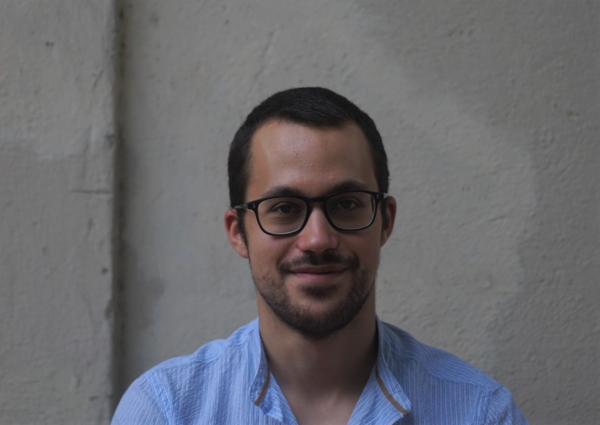

<h2 style="text-align: center;">

</h2>

Hi! My name is Emanuele Murgolo, and I'm a PhD student at [Universitat Pompeu Fabra](https://www.upf.edu/web/phd-political-and-social-sciences/), Barcelona,  under the supervision of prof. [Toni Rodon](https://tonirodon.cat/).

My main research interests are political power, social stratification, policing, incarceration, political and social geography. My doctoral research, titled “Political power, racial inequalities and state-sanctioned repression in the US: a spatial analysis”, aims at analyzing the role that policing and incarceration play in undermining the political power of Black communities in the US. 

I have a BA in Political, Social and International Sciences, and an MA in Local and Global Development, both from the University of Bologna, with an MA thesis exploring the relationship between the residential segregation of African Americans and the cycle of poverty in US urban areas. I have also worked as a research assistant for the OECD, and as a researcher at the Department of Economics of the University of Modena and Reggio Emilia.

